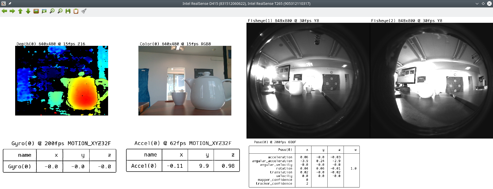

# How to connect multiple Realsense cameras at the same time.

## Using multiple Realsense cameras
* <a href="multiple_realsense_cameras.py">multiple_realsense_cameras.py</a>

The image shows example result for T265 and D415.

### Requires:
* OpenCv (cv2)
* numpy 
* PIL (or willow)
* pyrealsense2
* tableprint
* tempfile
* requests

## Older example for two T265 cameras
* <a href="multiple_T265_cameras.py">multiple_T265_cameras.py</a> - 
  not works for v2.31 till now for v2.34. (IntelRealSense pyrealsense2). 
  <a href="https://github.com/IntelRealSense/librealsense/issues/5614">See is #5614</a>
